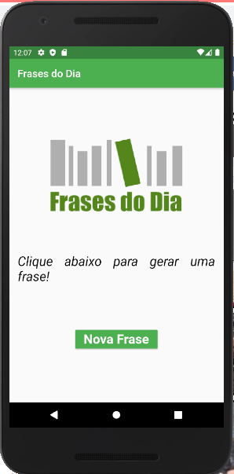

<h1 align="center">
   
</h1>

<h4 align="center"> 
	🚧 Olx Clone 🚀 Concluido...  🚧
</h4>

## 📚 Descrição

 - Este é meu primeiro App em Flutter, a função dele é mostrar uma frase positiva para o seu dia ao pressionar no botão

## 🛠 Tecnologias

As seguintes ferramentas foram usadas na construção do projeto:

-  [Flutter](https://flutter.dev/?gclid=Cj0KCQjwkbuKBhDRARIsAALysV4sMSKWcOxrlBmdtlCcf3MAfNdH1ehbbWi6ZjjjdypPLsSvdTFiqOYaAon3EALw_wcB&gclsrc=aw.ds)
-  [Dart](https://dart.dev/)

## 📱 Plataforma adotada

  - Android;
  - iOS;

## 📥 Download

  - [Android](https://drive.google.com/file/d/1rD7fgfT2OypBKIm6pSK3ItbyBIRojJKA/view?usp=sharing)
